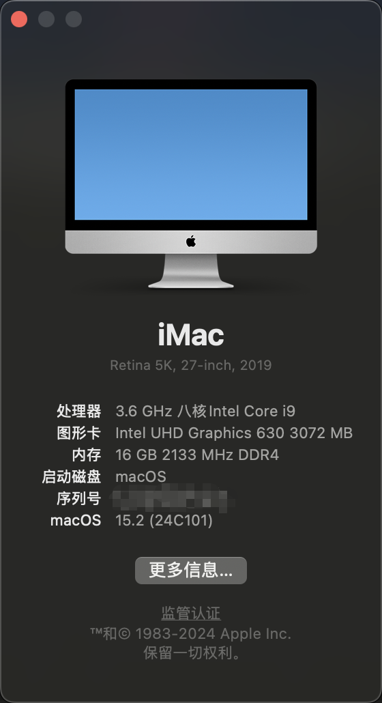

# hackintosh-ASUS-ROG-STRIX-Z390-E-GAMING

## System Information

                                      Azrael’s iMac iMac19.1
                                      ----------------------------------------------
                                      主板型号　: 　ASUS ROG STRIX Z390-E GAMING
                 ###                  操作系统　: 　15.2 24C101
               ####                   内核版本　: 　Darwin 24.2.0
               ###                    开机时间　: 　32 minutes
       #######    #######             Shell　　: 　/bin/zsh
     ######################           当前时间　: 　2025-01-20 21:22:36
    #####################             处理器　　: 　Intel Core i9-9900K 3.60GHz x (16)
    ####################              内存　　　: 　16 GB ( G.Skill DDR4 3200MHz x 2 )
    ####################              磁盘　　　: 　SamSung SSD 970 EVO Plus 500GB
    #####################             网卡　　　: 　Intel Wireless-AC 9560
     ######################           当前终端　: 　xterm-256color by iTerm.app
      ####################            显卡设备　: 　Intel UHD Graphics 630 / VRAM (Dynamic, Max): 2048 MB
        ################              主显示器　: 　Dell DELA0EC DELL U2723QE ( 27.7 )
         ####     #####               声卡　　　: 　Intel High Definition Audio Controller

## OpenCore Bootloader

This EFI is configurated according to [OpenCore Install Guide](https://dortania.github.io/OpenCore-Install-Guide/).

> Note: Backup your system before do anything.
>
> Note: Be sure to copy the entire folder
>
> Note: In order to use the WIFI function, you need to install [HeliPort](https://github.com/OpenIntelWireless/HeliPort/releases) and set it to start at boot.

- Info

  - version
    - BIOS: 1704
    - OpenCore: 1.0.3
    - MacOS: 15.2(Sequoia)

- Prerequisites

  - Disable
    - Fast Boot
    - Launch CSM
    - Secure Boot
      - Key Management
        - Clear Secure Boot Keys
    - System Agent(SA) Configuration
      - VT-d
    - CFG Lock
    - Onboard Devices Configuration
      - Serial Port Configuration
        - Serial Port: Off
  - Enable
    - System Agent(SA) Configuration
      - Above 4G decoding
      - Graphics Configuration
        - Primary Display: CPU Graphics
        - DVMT Pre-Allocated: 64MB
    - CPU Configuration
      - Hyper-Threading
    - USB Configuration
      - XHCI Hand-off
    - Secure Boot
      - OS type: Windows UEFI Mode

- USB Mapping

  

## Theme

- [Acidanthera's theme](https://github.com/acidanthera/OcBinaryData/tree/master/Resources)
- [chris1111's theme](https://github.com/chris1111/My-Simple-OC-Themes)

## [UHD630 FrameBuffer Patch](./frameBufferPatch.md)
