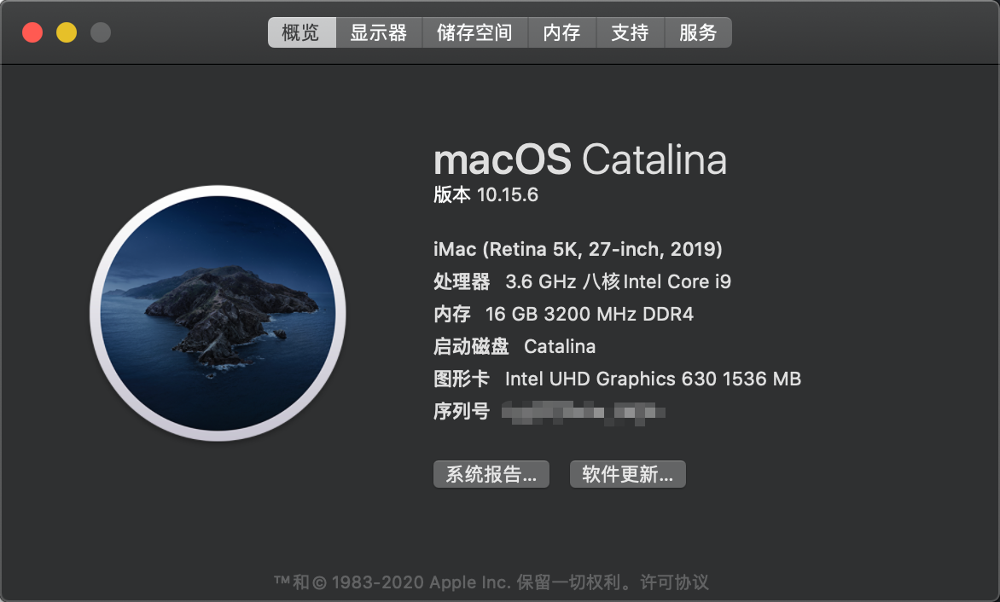

# hackintosh-ASUS-ROG-STRIX-Z390-E-GAMING

## System Information

                                      Azrael’s iMac iMac19,1
                                      ----------------------------------------------
                                      主板型号　: 　ASUS ROG STRIX Z390-E GAMING
                 ###                  操作系统　: 　10.15.6 19G73
               ####                   内核版本　: 　Darwin 19.6.0
               ###                    开机时间　: 　2 hours, 41 minutes
       #######    #######             Shell　　: 　/bin/zsh
     ######################           当前时间　: 　2020年 7月17日 星期五 23时10分13秒
    #####################             处理器　　: 　Intel Core i9-9900K 3.60GHz x (16)
    ####################              内存　　　: 　16 GB ( G.Skill DDR4 3200MHz x 2 )
    ####################              磁盘　　　: 　SamSung SSD 970 EVO Plus 500GB
    #####################             网卡　　　: 　Intel Wireless-AC 9560
     ######################           当前终端　: 　xterm-256color by iTerm.app
      ####################            显卡设备　: 　Intel UHD Graphics 630 / VRAM (Dynamic, Max): 1536 MB
        ################              主显示器　: 　Dell DELA0EC DELL U2718Q ( 27.7 )
         ####     #####               声卡　　　: 　Intel High Definition Audio Controller

## OpenCore Bootloader

This EFI is configurated according to [OpenCore Install Guide](https://dortania.github.io/OpenCore-Install-Guide/).

> Note: Please backup you system before switch to OpenCore Bootloader

> Note: If you use HDMI output, wait for a while

- Info

  - version
    - OpenCore: 0.6.3
    - Catalina: 10.15.7

- Prerequisites

  - Disable
    - Fast Boot
    - Launch CSM
    - Secure Boot
      - Key Management
        - Clear Secure Boot Keys
    - System Agent(SA) Configuration
      - VT-d
    - CFG Lock
    - Onboard Devices Configuration
      - Serial Port Configuration
        - Serial Port: Off
  - Enable
    - System Agent(SA) Configuration
      - Above 4G decoding
      - Graphics Configuration
        - Primary Display: CPU Graphics
        - DVMT Pre-Allocated: 64MB
    - CPU Configuration
      - Hyper-Threading
    - USB Configuration
      - XHCI Hand-off
    - Secure Boot
      - OS type: Windows UEFI Mode

## Clover Bootloader

I have switched to `OpenCore Bootloader`, `clover` will not be maintained later.

> Note: Don't use EFI-10.15.6, it has some problems

- Info

  - version
    - Clover: 5120
    - Catalina: 10.15.6

- theme with 3840 \* 2160 resolution

  - [Theme](https://github.com/badruzeus/MyCloverThemes)
